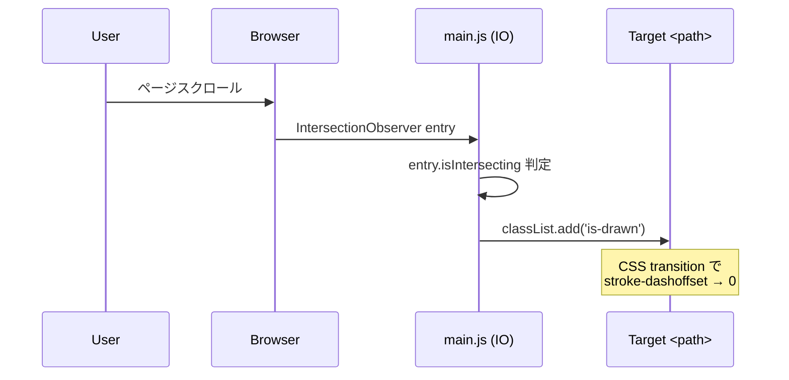
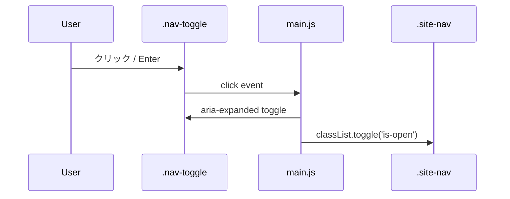
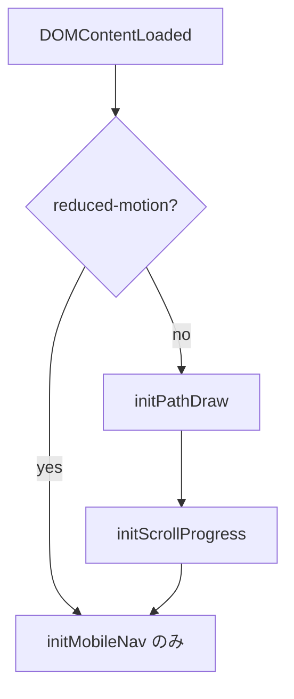

# Design: 神山まるごと高専 紹介サイト

## 1. アーキテクチャ概要

ビルドレス静的サイト。`main` ブランチ root を GitHub Pages の配信ソースとし、訪問者ブラウザが直接 HTML/CSS/JS を取得・実行する。

```
[Browser]
   │  HTTPS GET
   ▼
[GitHub Pages CDN]
   │  ファイルそのまま返却
   ▼
[main branch root]
   ├── index.html / about.html / campus.html / access.html
   ├── assets/css/main.css      … デザイントークン + 共通スタイル
   ├── assets/js/main.js        … スクロール演出 + ナビ制御
   ├── assets/images/*.svg      … プレースホルダー / 装飾 SVG
   └── .nojekyll                … Jekyll を無効化
```

### 1.1 サイトマップ

```
index.html (Top)
├─ about.html   (学校概要 / 教育の特徴 / カリキュラム)
├─ campus.html  (キャンパス / 全寮制)
└─ access.html  (所在地 / 公式サイト / 募集要項)
```

## 2. ファイル構成

| パス | 役割 |
|---|---|
| `index.html` | トップ。ヒーロー + 概要 3 カード + 各ページ導線 |
| `about.html` | 学校概要詳細・教育特徴・カリキュラム |
| `campus.html` | キャンパス・全寮制紹介 |
| `access.html` | アクセス・公式リンク集 |
| `assets/css/main.css` | デザイントークン (CSS 変数) / リセット / タイポ / コンポーネント |
| `assets/js/main.js` | IntersectionObserver パス描画 / モバイルナビ / スクロール進捗 |
| `assets/images/` | プレースホルダー SVG・装飾円弧・OGP 画像 |
| `.nojekyll` | Jekyll 処理回避 |
| `README.md` | 概要・公開 URL・ローカル確認手順 |

## 3. デザインシステム

### 3.1 デザイントークン (`:root` の CSS 変数)

```css
:root {
  --color-bg:        #ffffff;
  --color-fg:        #0a0a0a;
  --color-gray-50:   #f5f5f5;
  --color-gray-200:  #e5e5e5;
  --color-gray-500:  #999999;
  --color-gray-800:  #333333;

  --font-jp:  "Noto Sans JP", sans-serif;
  --font-en:  "Inter", sans-serif;

  --space-1: 0.25rem;
  --space-2: 0.5rem;
  --space-4: 1rem;
  --space-8: 2rem;
  --space-16: 4rem;
  --space-24: 6rem;

  --radius-full: 9999px;
  --container: 1120px;
  --bp-md: 768px;
  --bp-lg: 1024px;

  --ease-out: cubic-bezier(0.22, 1, 0.36, 1);
  --duration-base: 600ms;
}
```

### 3.2 共通コンポーネント

- `.site-header` / `.site-nav` / `.site-footer`
- `.btn` (`.btn--primary` 黒地白文字, `.btn--ghost` 線のみ)
- `.card` (細枠 + ホバーで影 / 円アクセント)
- `.section` (上下 `--space-24` パディング、見出しは大きく字間広め)
- `.circle-decor` (背景の浮遊円, `position: absolute` + `animation: float`)
- `.path-divider` (セクション間の SVG 円弧)

### 3.3 円とパスのモチーフ

- **背景円**: 各ページ 3〜5 個の SVG `<circle>` を `position: absolute` で配置し、`@keyframes float` で 8〜14 秒周期に上下浮遊。
- **セクション境界**: `<svg viewBox>` でなめらかな円弧 `path` を描き、上下セクションを接続。
- **スクロール描画**: 主要セクション見出し横に SVG パスを配置し、`stroke-dasharray` / `stroke-dashoffset` を IntersectionObserver で 0 に変化させ手書き風に描く。

## 4. 主要シーケンス

### 4.1 スクロールでパス描画



### 4.2 モバイルナビ開閉



## 5. JS モジュール設計 (`assets/js/main.js`)

| 関数 | 役割 |
|---|---|
| `initPathDraw()` | `[data-draw-path]` を持つ SVG を IntersectionObserver で監視し、可視化時に `is-drawn` を付与 |
| `initMobileNav()` | `.nav-toggle` のクリックで `.site-nav` を開閉、`aria-expanded` 同期、ESC で閉じる |
| `initScrollProgress()` | `window.scroll` をスロットルし、`<div class="scroll-progress">` の幅を更新 |
| `respectsReducedMotion()` | `matchMedia('(prefers-reduced-motion: reduce)')` を判定し、上記アニメ初期化をスキップ |



## 6. HTML 構造例 (共通)

```html
<!doctype html>
<html lang="ja">
<head>
  <meta charset="utf-8" />
  <meta name="viewport" content="width=device-width,initial-scale=1" />
  <title>神山まるごと高専 | …</title>
  <meta name="description" content="…" />
  <!-- OGP -->
  <meta property="og:title" content="…" />
  <meta property="og:image" content="./assets/images/ogp.png" />
  <link rel="icon" href="./assets/images/favicon.svg" />
  <link rel="preconnect" href="https://fonts.googleapis.com" />
  <link href="https://fonts.googleapis.com/css2?family=Inter:wght@400;700&family=Noto+Sans+JP:wght@400;700&display=swap" rel="stylesheet" />
  <link rel="stylesheet" href="./assets/css/main.css" />
</head>
<body>
  <header class="site-header">…</header>
  <main>…</main>
  <footer class="site-footer">…</footer>
  <script src="./assets/js/main.js" defer></script>
</body>
</html>
```

## 7. エラーハンドリングマトリクス

| 事象 | 影響 | 対応 |
|---|---|---|
| Google Fonts 読み込み失敗 | フォールバック `sans-serif` で表示 | `font-family` に system fallback を必ず指定 |
| JS 実行失敗（古いブラウザ） | アニメ無し / ナビは CSS フォールバック | `<details>` ベースのフォールバックナビ or 全表示 CSS |
| 画像未配置 (404) | プレースホルダー位置に空白 | プレースホルダー SVG をリポジトリに同梱しておく |
| プロジェクトサイトでの絶対パス参照 | 404 | すべて相対パス (`./...`) で統一 |
| Jekyll が `_` ファイルを除外 | 一部欠落 | `.nojekyll` を root に配置 |

## 8. テスト戦略

- **手動検証** (主):
  - 4 ページ全リンク踏破、ナビ動作、レスポンシブ崩れ確認
  - Lighthouse (Performance / Accessibility / Best Practices ≥ 90)
  - DevTools Network で全アセット 200 OK
  - Reduced Motion 設定でアニメ抑制を確認
- **自動検証** (任意):
  - HTML Validator (https://validator.w3.org/) で文法チェック
  - `npx pa11y` で a11y チェック（必要に応じて）

## 9. 設計上の決定 (Decision Records)

### Decision - 2026-04-22
- **Decision**: ビルドレス（素の HTML/CSS/JS）で構築
- **Context**: 4 ページの紹介サイト。複雑なロジックなし、CMS 不要
- **Options**:
  - A) 素 HTML/CSS/JS — 学習コスト 0、即配信、依存ゼロ
  - B) Astro / Vite — テンプレ再利用しやすい、ビルド・Actions 必要
- **Rationale**: 共通ヘッダー/フッターは 4 ファイルへのコピーで管理可能。ビルド不要で Pages 設定が最小
- **Impact**: 共通部の変更は 4 箇所手修正。ファイル数が増えたら再評価
- **Review**: ページ数が 6 を超えた時点で再検討

### Decision - 2026-04-22
- **Decision**: `main` / `/ (root)` をデプロイソースに採用
- **Context**: ビルド不要のためアーティファクトは存在しない
- **Options**: A) main/root, B) main/docs, C) GitHub Actions
- **Rationale**: 最小構成。ビルドなしで Actions のオーバーヘッドが不要
- **Impact**: README やワークフロー類もリポジトリ直下に同居。`.nojekyll` を必須化
- **Review**: ビルドが必要な技術を導入したら Actions 方式へ移行
